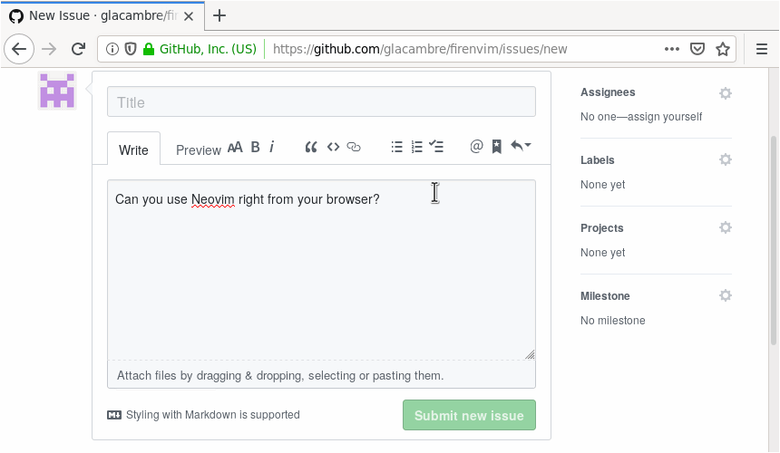

# Firenvim  [](https://github.com/glacambre/firenvim/actions?workflow=Test) [](https://lgtm.com/projects/g/glacambre/firenvim/alerts/) [](https://github.com/glacambre/firenvim/actions?workflow=Vint) [](https://github.com/glacambre/firenvim/actions?workflow=Luacheck) [](https://app.element.io/#/room/#firenvim:matrix.org) [](https://github.com/glacambre/firenvim/wiki)

Turn your browser¹ into a Neovim client (demos: [justinmk 🇺🇸](https://www.youtube.com/watch?v=suvh0yFfIB8), [ThePrimeagen 🇺🇸](https://www.youtube.com/watch?v=ID_kNcj9cMo), [Sean Feng 🇨🇳](https://www.youtube.com/watch?v=dNQJONKnJrg)).

¹ <sub>Firefox and Chrome are specifically supported. Other Chromium based browsers such as Brave, Vivaldi, and Opera should also work but are not specifically tested.</sub>



## How to use

Just click on any textarea and it will be immediately replaced by an instance of Firenvim. To set the content of the now hidden textarea to the content of the Neovim instance, simply `:w`. If you want to close the Firenvim overlay and return to the textarea, use `:q`. If you selected an element where you expected the Firenvim frame to appear and it didn't, try pressing `<C-e>`.

## Installing

Before installing anything please read [SECURITY.md](SECURITY.md) and make sure you're okay with everything mentioned. In the event you think of a way to compromise Firenvim, please send me an email (you can find my address in my commits).

1. Make sure you are using [Neovim][nvim] 0.4.0 or later. This plugin will not work with vanilla [VIM][vim] or [Vimr][vimr]. Also make sure that your browser hasn't been installed with Snap or Flatpak - these are sandboxed and thus won't work.

2. Check if the luabitop package is available by running `:lua bit.band(1,1)` in Neovim. If this throws an error, you will need to install it.

3. Install Firenvim as a VIM plugin as you would any other, then run the built-in post-install script.

    * [vim-plug](https://github.com/junegunn/vim-plug)

        ```vim
        Plug 'glacambre/firenvim', { 'do': { _ -> firenvim#install(0) } }
        ```

    * [dein](https://github.com/Shougo/dein.vim)

        ```vim
        call dein#add('glacambre/firenvim', { 'hook_post_update': { _ -> firenvim#install(0) } })
        ```
        
    * [packer](https://github.com/wbthomason/packer.nvim)

        ```lua
        use {
            'glacambre/firenvim',
            run = function() vim.fn['firenvim#install'](0) end 
        }
        ```

    * [minpac](https://github.com/k-takata/minpac)

        ```vim
        call minpac#add('glacambre/firenvim', { 'type': 'opt', 'do': 'packadd firenvim | call firenvim#install(0)'})
        if exists('g:started_by_firenvim')
          packadd firenvim
        endif
        ```

    * [pathogen](https://github.com/tpope/vim-pathogen), [vundle](https://github.com/VundleVim/Vundle.vim), others

        Install the plugin as you usually would, then run this shell command:

        ```sh
        $ nvim --headless "+call firenvim#install(0) | q"
        ```

4. Finally, install the Firenvim addon for your browser from [Mozilla's store](https://addons.mozilla.org/en-US/firefox/addon/firenvim/) or [Google's](https://chrome.google.com/webstore/detail/firenvim/egpjdkipkomnmjhjmdamaniclmdlobbo).

If you would rather build and install Firenvim from source, check [CONTRIBUTING.md](CONTRIBUTING.md).

#### Other browsers

Other browsers aren't supported for now. Opera, Vivaldi and other Chromium-based browsers should however work just like in Chromium and have similar install steps. Brave and Edge might work, Safari doesn't (it doesn't support Webextensions).

## Permissions

Firenvim currently requires the following permissions for the following reasons:

- [Access your data for all websites](https://support.mozilla.org/en-US/kb/permission-request-messages-firefox-extensions?as=u&utm_source=inproduct#w_access-your-data-for-all-websites): this is necessary in order to be able to append elements (= the neovim iframe) to the DOM.
- [Exchange messages with programs other than Firefox](https://support.mozilla.org/en-US/kb/permission-request-messages-firefox-extensions?as=u#w_exchange-messages-with-programs-other-than-firefox): this is necessary in order to be able to start neovim instances.
- [Access browser tabs](https://support.mozilla.org/en-US/kb/permission-request-messages-firefox-extensions?as=u#w_access-browser-tabs): This is required in order to find out what the current tab is.

## Configuring Firenvim

### Manually triggering Firenvim

You can configure the keybinding to manually trigger Firenvim (`<C-e>` by default) in [the shortcuts menu in `about://addons`](https://support.mozilla.org/en-US/kb/manage-extension-shortcuts-firefox) on Firefox, or in `chrome://extensions/shortcuts` on Chrome.

### Temporarily disabling Firenvim in a tab

Temporarily disabling (and re-enabling) Firenvim in a tab can be done either by clicking on the Firenvim button next to the urlbar or by configuring a browser shortcut (see the previous section to find out how browser shortcuts can be configured).

### Building a Firenvim-specific config

When it starts Neovim, Firenvim sets the variable `g:started_by_firenvim` which you can check to run different code in your init.vim. For example:

```vim
if exists('g:started_by_firenvim')
  set laststatus=0
else
  set laststatus=2
endif
```

Alternatively, you can detect when Firenvim connects to Neovim by using the `UIEnter` autocmd event:

```vim
function! s:IsFirenvimActive(event) abort
  if !exists('*nvim_get_chan_info')
    return 0
  endif
  let l:ui = nvim_get_chan_info(a:event.chan)
  return has_key(l:ui, 'client') && has_key(l:ui.client, 'name') &&
      \ l:ui.client.name =~? 'Firenvim'
endfunction

function! OnUIEnter(event) abort
  if s:IsFirenvimActive(a:event)
    set laststatus=0
  endif
endfunction
autocmd UIEnter * call OnUIEnter(deepcopy(v:event))
```

Similarly, you can detect when Firenvim disconnects from a Neovim instance with the `UILeave` autocommand.

### Using different settings depending on the page/element being edited

If you want to use different settings depending on the textarea you're currently editing, you can use autocommands to do that too. All buffers are named like this: `domainname_page_selector.txt` (see the [toFileName function](src/utils/utils.ts)). For example, this will set file type to markdown for all GitHub buffers:

```vim
au BufEnter github.com_*.txt set filetype=markdown
```

### Understanding Firenvim's configuration object

You can configure everything else about Firenvim by creating a dictionnary named `g:firenvim_config` in your init.vim and setting the keys "globalSettings" and "localSettings". In the dictionary `g:firenvim_config["localSettings"]` you can map Javascript patterns that match against the full URL to settings that are used for all URLs matched by that pattern. When multiple patterns match a URL, the pattern with the highest "priority" value is used. Here is an example (the settings and their possible values will be explained in the next subsections):

```vim
let g:firenvim_config = { 
    \ 'globalSettings': {
        \ 'alt': 'all',
    \  },
    \ 'localSettings': {
        \ '.*': {
            \ 'cmdline': 'neovim',
            \ 'content': 'text',
            \ 'priority': 0,
            \ 'selector': 'textarea',
            \ 'takeover': 'always',
        \ },
    \ }
\ }
```

With this configuration, `takeover` will be set to `always` on all websites. If we wanted to override this value on british websites, we could add the following lines to our init.vim. Notice how the priority of this new regex is higher than that of the `.*` regex:

```vim
let fc = g:firenvim_config['localSettings']
let fc['https?://[^/]+\.co\.uk/'] = { 'takeover': 'never', 'priority': 1 }
```

From now on, localSettings examples will use the `let fc[...] = ...` shorthand, assuming that you have defined a `g:firenvim_config` object and that you have a line like `let fc = g:firenvim_config['localSettings']` in your config.

### Configuring what elements Firenvim should appear on

The `selector` attribute of a localSetting controls what elements Firenvim automatically takes over. Here's the default value:

```vim
let fc['.*'] = { 'selector': 'textarea:not([readonly]), div[role="textbox"]' }
```

If you don't want to use Firenvim with rich text editors (e.g. Gmail, Outlook, Slack…) as a general rule, you might want to restrict Firenvim to simple textareas:

```vim
let fc['.*'] = { 'selector': 'textarea' }
```

Since `selector` is just a CSS selector, you have access to all of CSS's pseudo selectors, including [`:not()`](https://developer.mozilla.org/en-US/docs/Web/CSS/:not), which allows you to exclude elements that have certain attributes, like this:

```vim
let fc['.*'] = { 'selector': 'textarea:not([class=xxx])' }
```

### Configuring Firenvim to not always take over elements

Firenvim has a setting named `takeover` that can be set to `always`, `empty`, `never`, `nonempty` or `once`. When set to `always`, Firenvim will always take over elements for you. When set to `empty`, Firenvim will only take over empty elements. When set to `never`, Firenvim will never automatically appear, thus forcing you to use a keyboard shortcut in order to make the Firenvim frame appear. When set to `nonempty`, Firenvim will only take over elements that aren't empty. When set to `once`, Firenvim will take over elements the first time you select them, which means that after `:q`'ing Firenvim, you'll have to use the keyboard shortcut to make it appear again. Here's how to use the `takeover` setting:

```vim
let fc['.*'] = { 'takeover': 'always' }
```

### Using the external command line

You can chose between neovim's built-in command line and firenvim's command line by setting the localSetting named `cmdline` to either `neovim` or `firenvim`, e.g.:
```vim
let fc['.*'] = { 'cmdline' : 'firenvim' }
```

### Editing HTML directly

The `content` localSetting controls how Firenvim should read the content of an element. Setting it to `html` will make Firenvim fetch the content of elements as HTML, `text` will make it use plaintext. The default value is `text`:

```vim
let fc['.*'] = { 'content' : 'html' }
```

### Special characters on MacOS

On MacOS, the default keyboard layouts emit special characters when the alt (i.e. option) key is held down. From the perspective of the browser, these special characters replace the underlying "main" character of a keystroke event while retaining the modifier. For example, in the standard US layout the key chord alt-o is received in the browser as alt-ø rather than alt-o. Further, certain alt-chords represent "dead keys", which apply a diacritic to the next character entered. Pressing alt-e followed by a produces the single character "á" while alt-u followed by a produces "ä". To produce this behavior, diacritic-mapped strokes like alt-e and alt-u are themselves mapped to a ["Dead key" character](https://en.wikipedia.org/wiki/Dead_key). 

These behaviors complicate the support of special character and alt/meta (A- or M-) vim mappings on MacOS in two ways:

1. There is no way to generate unmodified special character key events. For example, since the only way to generate the character "ø" via the keyboard is by holding down alt, any key event with the "ø" character will also have an alt modifier. If we forward this directly to Vim, it will be received as `<M-ø>`.

2. There is no way to generate alt-modified plain alphanumeric characters. For example, an `<M-o>` mapping won't work because pressing alt-o generates `<M-ø>` rather than `<M-o>`.

Terminal and standalone GUI applications can solve these problems by changing the interpretation of the alt key at the application level. `Terminal.app` and `iTerm2`, for instance, both provide a "use Option as Meta key" preference that converts incoming alt-chords at the application level. Firenvim, however, is a browser extension that operates off of browser keystroke events rather than application-level events. At present, we are unsure how to implement this "use option as meta" functionality at the browser event level (help here is welcome!). However, there are some workarounds.

For problem (1), Firenvim will by default drop the alt key on MacOS for any special character, defined here as non-alphanumeric (not matching `/[a-zA-Z0-9]/`). This means alt-o will be forwarded to NeoVim as "ø" rather than "M-ø". Note that this behavior can be changed by setting the `alt` setting of the `globalSettings` configuration to `all`, like this:

### Making Firenvim ignore keys

You can make Firenvim ignore key presses (thus letting the browser handle them) by setting key-value pairs in `globalSettings.ignoreKeys`. The key needs to be the neovim mode the key press should be ignored in and the value should be an array containing the textual representation of the key press you want ignored. If you want to ignore a key press in all modes, you can use `all` as mode key.

For example, if you want to make Firenvim ignore `<C-1>` and `<C-2>` in normal mode and `<C-->` in all modes to let your browser handle them, you should define ignoreKeys like this:

```vim
let g:firenvim_config = {
    \ 'globalSettings': {
        \ 'ignoreKeys': {
            \ 'all': ['<C-->'],
            \ 'normal': ['<C-1>', '<C-2>']
        \ }
    \ }
\ }
```

Mode names are defined in [Neovim's cursor_shape.c](https://github.com/neovim/neovim/blob/master/src/nvim/cursor_shape.c). Note that if the key press contains multiple modifiers, Shift needs to be first, Alt second, Control third and OS/Meta last (e.g. `Ctrl+Alt+Shift+1` needs to be `<SAC-1>`). If your keyboard layout requires you to press shift in order to press numbers, shift should be present in the key representation (e.g. on french azerty keyboards, `<C-1>` should actually be `<SC-1>`).

### Interacting with the page

You can execute javascript in the page by using `firenvim#eval_js`. The code has to be a valid javascript expression (NOT a statement). You can provide the name of a function that should be executed with the result of the expression. Note that some pages prevent evaluating JavaScript with their [CSP](https://developer.mozilla.org/en-US/docs/Web/HTTP/CSP) and this can't be worked around. Here's an example:

```vim
call firenvim#eval_js('alert("Hello World!")', 'MyFunction')
```

You can move focus from the editor back to the page or the input field by calling `firenvim#focus_page` or `firenvim#focus_input`. Here's an example that does exactly this if you press `<Esc>` twice while in normal mode:

```vim
nnoremap <Esc><Esc> :call firenvim#focus_page()<CR>
```

There is also a function named `firenvim#hide_frame()` which will temporarily hide the Firenvim frame. You will then be able to bring the neovim frame back either by unfocusing and refocusing the textarea or by using the [keybinding to manually trigger Firenvim](https://github.com/glacambre/firenvim#manually-triggering-firenvim).

```vim
nnoremap <C-z> :call firenvim#hide_frame()<CR>
```

A function named `firenvim#press_keys()` will allow you to send key events to the underlying input field by taking a list of vim-like keys (e.g. `a`, `<CR>`, `<Space>`…) as argument. Note that this only "triggers" an event, it does not add text to the input field. For example if you'd like firenvim to send `<CR>` to the webpage when you press `<CR>` in the editor, you can use the following mapping which is useful with chat apps:

```vim
au BufEnter riot.im_* inoremap <CR> <Esc>:w<CR>:call firenvim#press_keys("<LT>CR>")<CR>ggdGa
```

Note that our goal is to make the mapping type `firenvim#press_keys("<CR>")` in vim's command prompt and then execute it. Since we want the keys `<CR>` to be typed and not <kbd>Enter</kbd> to be pressed, we can't use `<CR>` because it would be interpreted by `inoremap`. Hence we use `<LT>CR>` in order to type the keys `<CR>`. Similarly, if you want to type the keys `<C-CR>` you'd use `<LT>C-CR>`.

Known Issues: some websites do not react to `firenvim#press_keys` (e.g. Slack).

### Automatically syncing changes to the page

Since Firenvim simply uses the BufWrite event in order to detect when it needs to write neovim's buffers to the page, Firenvim can be made to automatically synchronize all changes like this:

```vim
au TextChanged * ++nested write
au TextChangedI * ++nested write
```

Depending on how large the edited buffer is, this could be a little slow. This more sophisticated approach will throttle writes:

```vim
let g:dont_write = v:false
function! My_Write(timer) abort
	let g:dont_write = v:false
	write
endfunction

function! Delay_My_Write() abort
	if g:dont_write
		return
	end
	let g:dont_write = v:true
	call timer_start(10000, 'My_Write')
endfunction

au TextChanged * ++nested call Delay_My_Write()
au TextChangedI * ++nested call Delay_My_Write()
```

### Configuring message timeout

Due to space constraints, the external command line covers part of the buffer. This can be a problem as sometimes neovim will send a message that tells Firenvim to draw the command line, and then never send the message to tell Firenvim to stop displaying it. In order to work around this problem, a "cmdlineTimeout" configuration option has been implemented, which makes Firenvim hide the external command line after the cursor has moved and some amount of milliseconds have passed:

```vim
let g:firenvim_config = {
    \ 'globalSettings': {
        \ 'cmdlineTimeout': 3000,
    \ }
\ }
```


## Drawbacks

Some keybindings, such as `<C-n>`, `<C-t>` and `<C-w>` are not overridable through usual means. This means that you have to tell your browser to let Firenvim override them by using [the shortcuts menu in `about://addons`](https://support.mozilla.org/en-US/kb/manage-extension-shortcuts-firefox) on Firefox and `chrome://extensions/shortcuts` in Chrome.

When it is possible to do so, if you press one of these keyboard shortcuts while not in a Firenvim frame, Firenvim will attempt to emulate the expected behavior of the shortcut. For example, pressing `<C-w>` in a Firenvim frame will tell neovim you pressed `<C-w>`, but outside of it it will tell the browser to close the current tab.

Controlling whether Firenvim should attempt to emulate the browser's default behavior can be done with global settings. The following snippet will tell Firenvim to simulate `<C-n>`'s default behavior while never simulating `<C-w>`'s:

```vim
let g:firenvim_config = {
    \ 'globalSettings': {
        \ '<C-w>': 'noop',
        \ '<C-n>': 'default',
    \ }
\ }
```

Note that on Firefox on Linux some keyboard shortcuts might not be overridable. I circumvent this issue by running a [patched](https://github.com/glacambre/firefox-patches) version of Firefox (note: once Firefox is patched, you won't need to setup webextension keyboard shortcuts).

## You might also like

- [Tridactyl](https://github.com/tridactyl/tridactyl), provides vim-like keybindings to use Firefox. Also lets you edit input fields and text areas in your favourite editor with its `:editor` command.
- [GhostText](https://github.com/GhostText/GhostText), lets you edit text areas in your editor with a single click. Requires installing a plugin in your editor too. Features live updates!
- [Textern](https://github.com/jlebon/textern), a Firefox addon that lets you edit text areas in your editor without requiring you to install a plugin in your editor.
- [withExEditor](https://github.com/asamuzaK/withExEditor), same thing as Textern, except you can also edit/view a page's source with your editor.

 [nvim]: https://neovim.io
 [vim]: https://www.vim.org
 [vimr]: https://github.com/qvacua/vimr
